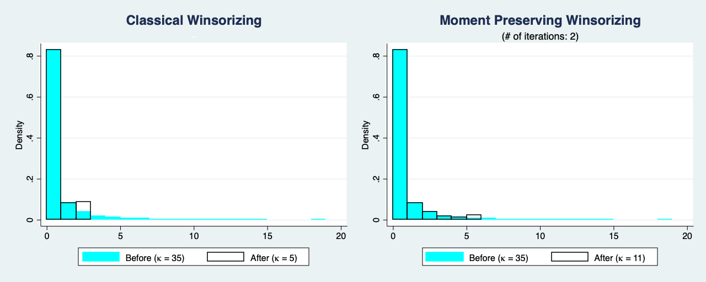

# Moment Preserving Winsorizing in Stata

Adjusting extreme realizations ('outliers') of a variable is called _winsorizing_. It is commonly implemented by one of two approaches:
- set a lower and upper percentile and replace all extreme realizations with the values of those percentiles
- set a number of extreme values to be replaced by their neighbors which are closer to the variable's mean

In Stata, the SSC packages `winsor` and `winsor2` allow to perform winsorizing variables as described above.

**However, winsorizing variables in this way changes the values of their moments**. But for certain statistical purposes, it can be necessary to preserve them. In other words, the winsorizing procedure should respect boundary conditions on the variables' moments.

Yet, the two Stata packages mentioned above do not provide this feature.

As an illustration of these distinct winsorizing techniques, the panel below shows a variable created from 5000 random draws from the pdf of a [gamma distribution](https://en.wikipedia.org/wiki/Gamma_distribution) before and after winsorizing. It also displays the corresponding [kurtosis](https://en.wikipedia.org/wiki/Kurtosis), i.e. the fourth moment.

The left figure has been created with Stata's `winsor` and the right one with `winsor_moment_preserving.do`. This do file conducts a modified winsorizing procedure which allows to control the value of the kurtosis. In this example, it has been set to remain close to 12.  

`winsor_moment_preserving.do` follows an iterative approach:
1. set lower bound on the kurtosis: _kappa_lower_ (12)
2. set initial lower and upper percentiles (1 and 99)
3. winsorize the variable
4. compute the kurtosis of the winsorized variable 
  - if kurtosis > _kappa_lower_: update lower and upper percentiles by 1 and return to step 3
  - else: proceed with step 5
5. report number of iterations

This repository contains additional files:
- `winsor_plot.do`: creates the plot shown above
- `winsor_moment_preserving_extended.do`: shows how to extend the moment preserving winsorizing to account for additional data dimensions (in this case, firm ids, sectors and years)
- `data_extended.dta`: contains the data used by `winsor_moment_preserving_extended.do`
